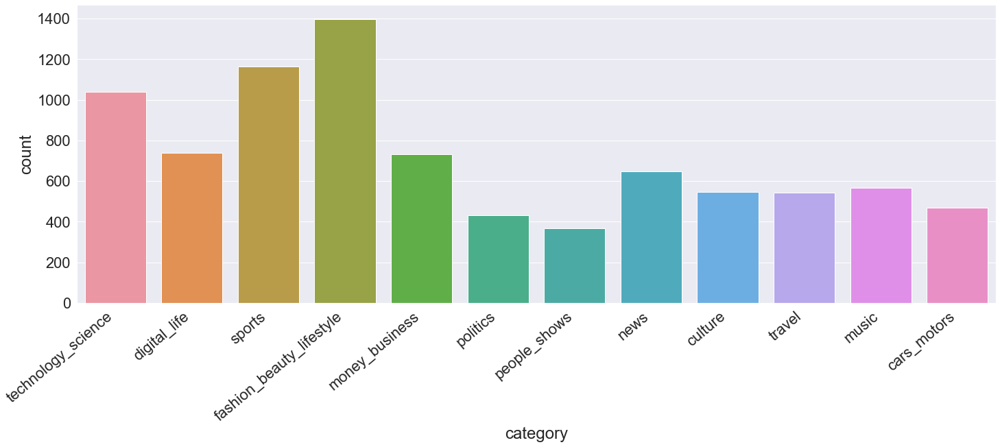
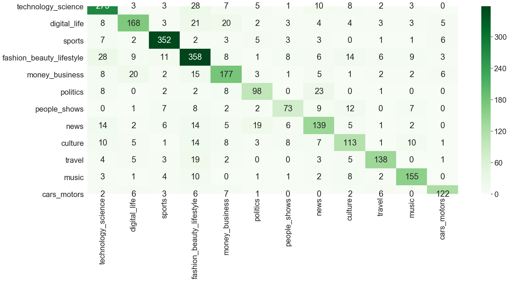

# Upday Assignment


1. Library and Data Import
2. A little Analysis
3. Data Cleansing and Preparation
4. Text Vectorization w/ Doc2Vec
5. A bit more Data Preparation and Test/Train Splitting
6. Stratified Cross Validation
7. Evaluation
8. Result

# 1. Library and Data Import
Let's get started with the easiest part of this task. Importing libraries, getting the necessary stopwords and importing the Dataset


```python
import pandas as pd
from gensim.models.doc2vec import Doc2Vec, TaggedDocument
from gensim.models import Word2Vec
import re
from sklearn.model_selection import train_test_split
from sklearn.preprocessing import LabelEncoder
import numpy as np
import nltk
from nltk.tokenize import word_tokenize
```


```python
nltk.download('all')
```

    [nltk_data] Downloading collection 'all'
    [nltk_data]    | 
    [nltk_data]    | Downloading package abc to
    [nltk_data]    |     C:\Users\D\AppData\Roaming\nltk_data...
    [nltk_data]    |   Package abc is already up-to-date!
    [nltk_data]    | Downloading package alpino to
    [nltk_data]    |     C:\Users\D\AppData\Roaming\nltk_data...
    [nltk_data]    |   Package alpino is already up-to-date!
    [nltk_data]    | Downloading package biocreative_ppi to
    [nltk_data]    |     C:\Users\D\AppData\Roaming\nltk_data...
    [nltk_data]    |   Package biocreative_ppi is already up-to-date!
    [nltk_data]    | Downloading package brown to
    [nltk_data]    |     C:\Users\D\AppData\Roaming\nltk_data...
    [nltk_data]    |   Package brown is already up-to-date!
    [nltk_data]    | Downloading package brown_tei to
    [nltk_data]    |     C:\Users\D\AppData\Roaming\nltk_data...
    [nltk_data]    |   Package brown_tei is already up-to-date!
    [nltk_data]    | Downloading package cess_cat to
    [nltk_data]    |     C:\Users\D\AppData\Roaming\nltk_data...
    [nltk_data]    |   Package cess_cat is already up-to-date!
    [nltk_data]    | Downloading package cess_esp to
    [nltk_data]    |     C:\Users\D\AppData\Roaming\nltk_data...
    [nltk_data]    |   Package cess_esp is already up-to-date!
    [nltk_data]    | Downloading package chat80 to
    [nltk_data]    |     C:\Users\D\AppData\Roaming\nltk_data...
    [nltk_data]    |   Package chat80 is already up-to-date!
    [nltk_data]    | Downloading package city_database to
    [nltk_data]    |     C:\Users\D\AppData\Roaming\nltk_data...
    [nltk_data]    |   Package city_database is already up-to-date!
    [nltk_data]    | Downloading package cmudict to
    [nltk_data]    |     C:\Users\D\AppData\Roaming\nltk_data...
    [nltk_data]    |   Package cmudict is already up-to-date!
    [nltk_data]    | Downloading package comparative_sentences to
    [nltk_data]    |     C:\Users\D\AppData\Roaming\nltk_data...
    [nltk_data]    |   Package comparative_sentences is already up-to-
    [nltk_data]    |       date!
    [nltk_data]    | Downloading package comtrans to
    [nltk_data]    |     C:\Users\D\AppData\Roaming\nltk_data...
    [nltk_data]    |   Package comtrans is already up-to-date!
    [nltk_data]    | Downloading package conll2000 to
    [nltk_data]    |     C:\Users\D\AppData\Roaming\nltk_data...
    [nltk_data]    |   Package conll2000 is already up-to-date!
    [nltk_data]    | Downloading package conll2002 to
    [nltk_data]    |     C:\Users\D\AppData\Roaming\nltk_data...
    [nltk_data]    |   Package conll2002 is already up-to-date!
    [nltk_data]    | Downloading package conll2007 to
    [nltk_data]    |     C:\Users\D\AppData\Roaming\nltk_data...
    [nltk_data]    |   Package conll2007 is already up-to-date!
    [nltk_data]    | Downloading package crubadan to
    [nltk_data]    |     C:\Users\D\AppData\Roaming\nltk_data...
    [nltk_data]    |   Package crubadan is already up-to-date!
    [nltk_data]    | Downloading package dependency_treebank to
    [nltk_data]    |     C:\Users\D\AppData\Roaming\nltk_data...
    [nltk_data]    |   Package dependency_treebank is already up-to-date!
    [nltk_data]    | Downloading package dolch to
    [nltk_data]    |     C:\Users\D\AppData\Roaming\nltk_data...
    [nltk_data]    |   Package dolch is already up-to-date!
    [nltk_data]    | Downloading package europarl_raw to
    [nltk_data]    |     C:\Users\D\AppData\Roaming\nltk_data...
    [nltk_data]    |   Package europarl_raw is already up-to-date!
    [nltk_data]    | Downloading package floresta to
    [nltk_data]    |     C:\Users\D\AppData\Roaming\nltk_data...
    [nltk_data]    |   Package floresta is already up-to-date!
    [nltk_data]    | Downloading package framenet_v15 to
    [nltk_data]    |     C:\Users\D\AppData\Roaming\nltk_data...
    [nltk_data]    |   Package framenet_v15 is already up-to-date!
    [nltk_data]    | Downloading package framenet_v17 to
    [nltk_data]    |     C:\Users\D\AppData\Roaming\nltk_data...
    [nltk_data]    |   Package framenet_v17 is already up-to-date!
    [nltk_data]    | Downloading package gazetteers to
    [nltk_data]    |     C:\Users\D\AppData\Roaming\nltk_data...
    [nltk_data]    |   Package gazetteers is already up-to-date!
    [nltk_data]    | Downloading package genesis to
    [nltk_data]    |     C:\Users\D\AppData\Roaming\nltk_data...
    [nltk_data]    |   Package genesis is already up-to-date!
    [nltk_data]    | Downloading package gutenberg to
    [nltk_data]    |     C:\Users\D\AppData\Roaming\nltk_data...
    [nltk_data]    |   Package gutenberg is already up-to-date!
    [nltk_data]    | Downloading package ieer to
    [nltk_data]    |     C:\Users\D\AppData\Roaming\nltk_data...
    [nltk_data]    |   Package ieer is already up-to-date!
    [nltk_data]    | Downloading package inaugural to
    [nltk_data]    |     C:\Users\D\AppData\Roaming\nltk_data...
    [nltk_data]    |   Package inaugural is already up-to-date!
    [nltk_data]    | Downloading package indian to
    [nltk_data]    |     C:\Users\D\AppData\Roaming\nltk_data...
    [nltk_data]    |   Package indian is already up-to-date!
    [nltk_data]    | Downloading package jeita to
    [nltk_data]    |     C:\Users\D\AppData\Roaming\nltk_data...
    [nltk_data]    |   Package jeita is already up-to-date!
    [nltk_data]    | Downloading package kimmo to
    [nltk_data]    |     C:\Users\D\AppData\Roaming\nltk_data...
    [nltk_data]    |   Package kimmo is already up-to-date!
    [nltk_data]    | Downloading package knbc to
    [nltk_data]    |     C:\Users\D\AppData\Roaming\nltk_data...
    [nltk_data]    |   Package knbc is already up-to-date!
    [nltk_data]    | Downloading package lin_thesaurus to
    [nltk_data]    |     C:\Users\D\AppData\Roaming\nltk_data...
    [nltk_data]    |   Package lin_thesaurus is already up-to-date!
    [nltk_data]    | Downloading package mac_morpho to
    [nltk_data]    |     C:\Users\D\AppData\Roaming\nltk_data...
    [nltk_data]    |   Package mac_morpho is already up-to-date!
    [nltk_data]    | Downloading package machado to
    [nltk_data]    |     C:\Users\D\AppData\Roaming\nltk_data...
    [nltk_data]    |   Package machado is already up-to-date!
    [nltk_data]    | Downloading package masc_tagged to
    [nltk_data]    |     C:\Users\D\AppData\Roaming\nltk_data...
    [nltk_data]    |   Package masc_tagged is already up-to-date!
    [nltk_data]    | Downloading package moses_sample to
    [nltk_data]    |     C:\Users\D\AppData\Roaming\nltk_data...
    [nltk_data]    |   Package moses_sample is already up-to-date!
    [nltk_data]    | Downloading package movie_reviews to
    [nltk_data]    |     C:\Users\D\AppData\Roaming\nltk_data...
    [nltk_data]    |   Package movie_reviews is already up-to-date!
    [nltk_data]    | Downloading package names to
    [nltk_data]    |     C:\Users\D\AppData\Roaming\nltk_data...
    [nltk_data]    |   Package names is already up-to-date!
    [nltk_data]    | Downloading package nombank.1.0 to
    [nltk_data]    |     C:\Users\D\AppData\Roaming\nltk_data...
    [nltk_data]    |   Package nombank.1.0 is already up-to-date!
    [nltk_data]    | Downloading package nps_chat to
    [nltk_data]    |     C:\Users\D\AppData\Roaming\nltk_data...
    [nltk_data]    |   Package nps_chat is already up-to-date!
    [nltk_data]    | Downloading package omw to
    [nltk_data]    |     C:\Users\D\AppData\Roaming\nltk_data...
    [nltk_data]    |   Package omw is already up-to-date!
    [nltk_data]    | Downloading package opinion_lexicon to
    [nltk_data]    |     C:\Users\D\AppData\Roaming\nltk_data...
    [nltk_data]    |   Package opinion_lexicon is already up-to-date!
    [nltk_data]    | Downloading package paradigms to
    [nltk_data]    |     C:\Users\D\AppData\Roaming\nltk_data...
    [nltk_data]    |   Package paradigms is already up-to-date!
    [nltk_data]    | Downloading package pil to
    [nltk_data]    |     C:\Users\D\AppData\Roaming\nltk_data...
    [nltk_data]    |   Package pil is already up-to-date!
    [nltk_data]    | Downloading package pl196x to
    [nltk_data]    |     C:\Users\D\AppData\Roaming\nltk_data...
    [nltk_data]    |   Package pl196x is already up-to-date!
    [nltk_data]    | Downloading package ppattach to
    [nltk_data]    |     C:\Users\D\AppData\Roaming\nltk_data...
    [nltk_data]    |   Package ppattach is already up-to-date!
    [nltk_data]    | Downloading package problem_reports to
    [nltk_data]    |     C:\Users\D\AppData\Roaming\nltk_data...
    [nltk_data]    |   Package problem_reports is already up-to-date!
    [nltk_data]    | Downloading package propbank to
    [nltk_data]    |     C:\Users\D\AppData\Roaming\nltk_data...
    [nltk_data]    |   Package propbank is already up-to-date!
    [nltk_data]    | Downloading package ptb to
    [nltk_data]    |     C:\Users\D\AppData\Roaming\nltk_data...
    [nltk_data]    |   Package ptb is already up-to-date!
    [nltk_data]    | Downloading package product_reviews_1 to
    [nltk_data]    |     C:\Users\D\AppData\Roaming\nltk_data...
    [nltk_data]    |   Package product_reviews_1 is already up-to-date!
    [nltk_data]    | Downloading package product_reviews_2 to
    [nltk_data]    |     C:\Users\D\AppData\Roaming\nltk_data...
    [nltk_data]    |   Package product_reviews_2 is already up-to-date!
    [nltk_data]    | Downloading package pros_cons to
    [nltk_data]    |     C:\Users\D\AppData\Roaming\nltk_data...
    [nltk_data]    |   Package pros_cons is already up-to-date!
    [nltk_data]    | Downloading package qc to
    [nltk_data]    |     C:\Users\D\AppData\Roaming\nltk_data...
    [nltk_data]    |   Package qc is already up-to-date!
    [nltk_data]    | Downloading package reuters to
    [nltk_data]    |     C:\Users\D\AppData\Roaming\nltk_data...
    [nltk_data]    |   Package reuters is already up-to-date!
    [nltk_data]    | Downloading package rte to
    [nltk_data]    |     C:\Users\D\AppData\Roaming\nltk_data...
    [nltk_data]    |   Package rte is already up-to-date!
    [nltk_data]    | Downloading package semcor to
    [nltk_data]    |     C:\Users\D\AppData\Roaming\nltk_data...
    [nltk_data]    |   Package semcor is already up-to-date!
    [nltk_data]    | Downloading package senseval to
    [nltk_data]    |     C:\Users\D\AppData\Roaming\nltk_data...
    [nltk_data]    |   Package senseval is already up-to-date!
    [nltk_data]    | Downloading package sentiwordnet to
    [nltk_data]    |     C:\Users\D\AppData\Roaming\nltk_data...
    [nltk_data]    |   Package sentiwordnet is already up-to-date!
    [nltk_data]    | Downloading package sentence_polarity to
    [nltk_data]    |     C:\Users\D\AppData\Roaming\nltk_data...
    [nltk_data]    |   Package sentence_polarity is already up-to-date!
    [nltk_data]    | Downloading package shakespeare to
    [nltk_data]    |     C:\Users\D\AppData\Roaming\nltk_data...
    [nltk_data]    |   Package shakespeare is already up-to-date!
    [nltk_data]    | Downloading package sinica_treebank to
    [nltk_data]    |     C:\Users\D\AppData\Roaming\nltk_data...
    [nltk_data]    |   Package sinica_treebank is already up-to-date!
    [nltk_data]    | Downloading package smultron to
    [nltk_data]    |     C:\Users\D\AppData\Roaming\nltk_data...
    [nltk_data]    |   Package smultron is already up-to-date!
    [nltk_data]    | Downloading package state_union to
    [nltk_data]    |     C:\Users\D\AppData\Roaming\nltk_data...
    [nltk_data]    |   Package state_union is already up-to-date!
    [nltk_data]    | Downloading package stopwords to
    [nltk_data]    |     C:\Users\D\AppData\Roaming\nltk_data...
    [nltk_data]    |   Package stopwords is already up-to-date!
    [nltk_data]    | Downloading package subjectivity to
    [nltk_data]    |     C:\Users\D\AppData\Roaming\nltk_data...
    [nltk_data]    |   Package subjectivity is already up-to-date!
    [nltk_data]    | Downloading package swadesh to
    [nltk_data]    |     C:\Users\D\AppData\Roaming\nltk_data...
    [nltk_data]    |   Package swadesh is already up-to-date!
    [nltk_data]    | Downloading package switchboard to
    [nltk_data]    |     C:\Users\D\AppData\Roaming\nltk_data...
    [nltk_data]    |   Package switchboard is already up-to-date!
    [nltk_data]    | Downloading package timit to
    [nltk_data]    |     C:\Users\D\AppData\Roaming\nltk_data...
    [nltk_data]    |   Package timit is already up-to-date!
    [nltk_data]    | Downloading package toolbox to
    [nltk_data]    |     C:\Users\D\AppData\Roaming\nltk_data...
    [nltk_data]    |   Package toolbox is already up-to-date!
    [nltk_data]    | Downloading package treebank to
    [nltk_data]    |     C:\Users\D\AppData\Roaming\nltk_data...
    [nltk_data]    |   Package treebank is already up-to-date!
    [nltk_data]    | Downloading package twitter_samples to
    [nltk_data]    |     C:\Users\D\AppData\Roaming\nltk_data...
    [nltk_data]    |   Package twitter_samples is already up-to-date!
    [nltk_data]    | Downloading package udhr to
    [nltk_data]    |     C:\Users\D\AppData\Roaming\nltk_data...
    [nltk_data]    |   Package udhr is already up-to-date!
    [nltk_data]    | Downloading package udhr2 to
    [nltk_data]    |     C:\Users\D\AppData\Roaming\nltk_data...
    [nltk_data]    |   Package udhr2 is already up-to-date!
    [nltk_data]    | Downloading package unicode_samples to
    [nltk_data]    |     C:\Users\D\AppData\Roaming\nltk_data...
    [nltk_data]    |   Package unicode_samples is already up-to-date!
    [nltk_data]    | Downloading package universal_treebanks_v20 to
    [nltk_data]    |     C:\Users\D\AppData\Roaming\nltk_data...
    [nltk_data]    |   Package universal_treebanks_v20 is already up-to-
    [nltk_data]    |       date!
    [nltk_data]    | Downloading package verbnet to
    [nltk_data]    |     C:\Users\D\AppData\Roaming\nltk_data...
    [nltk_data]    |   Package verbnet is already up-to-date!
    [nltk_data]    | Downloading package verbnet3 to
    [nltk_data]    |     C:\Users\D\AppData\Roaming\nltk_data...
    [nltk_data]    |   Package verbnet3 is already up-to-date!
    [nltk_data]    | Downloading package webtext to
    [nltk_data]    |     C:\Users\D\AppData\Roaming\nltk_data...
    [nltk_data]    |   Package webtext is already up-to-date!
    [nltk_data]    | Downloading package wordnet to
    [nltk_data]    |     C:\Users\D\AppData\Roaming\nltk_data...
    [nltk_data]    |   Package wordnet is already up-to-date!
    [nltk_data]    | Downloading package wordnet_ic to
    [nltk_data]    |     C:\Users\D\AppData\Roaming\nltk_data...
    [nltk_data]    |   Package wordnet_ic is already up-to-date!
    [nltk_data]    | Downloading package words to
    [nltk_data]    |     C:\Users\D\AppData\Roaming\nltk_data...
    [nltk_data]    |   Package words is already up-to-date!
    [nltk_data]    | Downloading package ycoe to
    [nltk_data]    |     C:\Users\D\AppData\Roaming\nltk_data...
    [nltk_data]    |   Package ycoe is already up-to-date!
    [nltk_data]    | Downloading package rslp to
    [nltk_data]    |     C:\Users\D\AppData\Roaming\nltk_data...
    [nltk_data]    |   Package rslp is already up-to-date!
    [nltk_data]    | Downloading package maxent_treebank_pos_tagger to
    [nltk_data]    |     C:\Users\D\AppData\Roaming\nltk_data...
    [nltk_data]    |   Package maxent_treebank_pos_tagger is already up-
    [nltk_data]    |       to-date!
    [nltk_data]    | Downloading package universal_tagset to
    [nltk_data]    |     C:\Users\D\AppData\Roaming\nltk_data...
    [nltk_data]    |   Package universal_tagset is already up-to-date!
    [nltk_data]    | Downloading package maxent_ne_chunker to
    [nltk_data]    |     C:\Users\D\AppData\Roaming\nltk_data...
    [nltk_data]    |   Package maxent_ne_chunker is already up-to-date!
    [nltk_data]    | Downloading package punkt to
    [nltk_data]    |     C:\Users\D\AppData\Roaming\nltk_data...
    [nltk_data]    |   Package punkt is already up-to-date!
    [nltk_data]    | Downloading package book_grammars to
    [nltk_data]    |     C:\Users\D\AppData\Roaming\nltk_data...
    [nltk_data]    |   Package book_grammars is already up-to-date!
    [nltk_data]    | Downloading package sample_grammars to
    [nltk_data]    |     C:\Users\D\AppData\Roaming\nltk_data...
    [nltk_data]    |   Package sample_grammars is already up-to-date!
    [nltk_data]    | Downloading package spanish_grammars to
    [nltk_data]    |     C:\Users\D\AppData\Roaming\nltk_data...
    [nltk_data]    |   Package spanish_grammars is already up-to-date!
    [nltk_data]    | Downloading package basque_grammars to
    [nltk_data]    |     C:\Users\D\AppData\Roaming\nltk_data...
    [nltk_data]    |   Package basque_grammars is already up-to-date!
    [nltk_data]    | Downloading package large_grammars to
    [nltk_data]    |     C:\Users\D\AppData\Roaming\nltk_data...
    [nltk_data]    |   Package large_grammars is already up-to-date!
    [nltk_data]    | Downloading package tagsets to
    [nltk_data]    |     C:\Users\D\AppData\Roaming\nltk_data...
    [nltk_data]    |   Package tagsets is already up-to-date!
    [nltk_data]    | Downloading package snowball_data to
    [nltk_data]    |     C:\Users\D\AppData\Roaming\nltk_data...
    [nltk_data]    |   Package snowball_data is already up-to-date!
    [nltk_data]    | Downloading package bllip_wsj_no_aux to
    [nltk_data]    |     C:\Users\D\AppData\Roaming\nltk_data...
    [nltk_data]    |   Package bllip_wsj_no_aux is already up-to-date!
    [nltk_data]    | Downloading package word2vec_sample to
    [nltk_data]    |     C:\Users\D\AppData\Roaming\nltk_data...
    [nltk_data]    |   Package word2vec_sample is already up-to-date!
    [nltk_data]    | Downloading package panlex_swadesh to
    [nltk_data]    |     C:\Users\D\AppData\Roaming\nltk_data...
    [nltk_data]    |   Package panlex_swadesh is already up-to-date!
    [nltk_data]    | Downloading package mte_teip5 to
    [nltk_data]    |     C:\Users\D\AppData\Roaming\nltk_data...
    [nltk_data]    |   Package mte_teip5 is already up-to-date!
    [nltk_data]    | Downloading package averaged_perceptron_tagger to
    [nltk_data]    |     C:\Users\D\AppData\Roaming\nltk_data...
    [nltk_data]    |   Package averaged_perceptron_tagger is already up-
    [nltk_data]    |       to-date!
    [nltk_data]    | Downloading package averaged_perceptron_tagger_ru to
    [nltk_data]    |     C:\Users\D\AppData\Roaming\nltk_data...
    [nltk_data]    |   Package averaged_perceptron_tagger_ru is already
    [nltk_data]    |       up-to-date!
    [nltk_data]    | Downloading package perluniprops to
    [nltk_data]    |     C:\Users\D\AppData\Roaming\nltk_data...
    [nltk_data]    |   Package perluniprops is already up-to-date!
    [nltk_data]    | Downloading package nonbreaking_prefixes to
    [nltk_data]    |     C:\Users\D\AppData\Roaming\nltk_data...
    [nltk_data]    |   Package nonbreaking_prefixes is already up-to-date!
    [nltk_data]    | Downloading package vader_lexicon to
    [nltk_data]    |     C:\Users\D\AppData\Roaming\nltk_data...
    [nltk_data]    |   Package vader_lexicon is already up-to-date!
    [nltk_data]    | Downloading package porter_test to
    [nltk_data]    |     C:\Users\D\AppData\Roaming\nltk_data...
    [nltk_data]    |   Package porter_test is already up-to-date!
    [nltk_data]    | Downloading package wmt15_eval to
    [nltk_data]    |     C:\Users\D\AppData\Roaming\nltk_data...
    [nltk_data]    |   Package wmt15_eval is already up-to-date!
    [nltk_data]    | Downloading package mwa_ppdb to
    [nltk_data]    |     C:\Users\D\AppData\Roaming\nltk_data...
    [nltk_data]    |   Package mwa_ppdb is already up-to-date!
    [nltk_data]    | 
    [nltk_data]  Done downloading collection all
    


    True


```python
from nltk.corpus import stopwords
stop = stopwords.words('english')
```


```python
df = pd.read_csv('data_redacted.tsv', sep='\t')
```

# 2. A little Analysis


```python
df.head()
```


<div>
<style scoped>
    .dataframe tbody tr th:only-of-type {
        vertical-align: middle;
    }

    .dataframe tbody tr th {
        vertical-align: top;
    }

    .dataframe thead th {
        text-align: right;
    }
</style>
<table border="1" class="dataframe">
  <thead>
    <tr style="text-align: right;">
      <th></th>
      <th>title</th>
      <th>text</th>
      <th>url</th>
      <th>category</th>
    </tr>
  </thead>
  <tbody>
    <tr>
      <td>0</td>
      <td>Don"t Mourn the Y Chromosome</td>
      <td>The human Y chromosome may vanish one day, but...</td>
      <td>http://discovermagazine.com/2014/nov/13-y-not</td>
      <td>technology_science</td>
    </tr>
    <tr>
      <td>1</td>
      <td>Destiny: Bungie to introduce ammo pack micro-t...</td>
      <td>Bungie is putting together plans to start sell...</td>
      <td>http://www.ibtimes.co.uk/destiny-bungie-introd...</td>
      <td>digital_life</td>
    </tr>
    <tr>
      <td>2</td>
      <td>Daruvala to race for Josef Kaufmann Racing in ...</td>
      <td>Highly rated Jehan Daruvala will race for Jose...</td>
      <td>http://www.thecheckeredflag.co.uk/2015/12/daru...</td>
      <td>sports</td>
    </tr>
    <tr>
      <td>3</td>
      <td>Secondary tropical forests absorb carbon at hi...</td>
      <td>Forests are an important carbon sink. While mo...</td>
      <td>http://www.sciencedaily.com/releases/2016/02/1...</td>
      <td>technology_science</td>
    </tr>
    <tr>
      <td>4</td>
      <td>This Brow Hack Will Change the Way You Fill In...</td>
      <td>Before everyone was trying to get eyebrows on ...</td>
      <td>http://www.popsugar.com/beauty/How-Use-Brow-Ge...</td>
      <td>fashion_beauty_lifestyle</td>
    </tr>
  </tbody>
</table>
</div>


We are able to see that the dataset consists of the target feature "category" as well as full article text, the headline and url. At first glance, it looks promising. 


```python
df.shape
```


    (8646, 4)


Our dataset contains 8467 articles and fortunately, we do not have any missing values :D


```python
df.isnull().sum()
```


    title       0
    text        0
    url         0
    category    0
    dtype: int64


Let's check the distribution of the target feature - We see the majority class as "fashion, beauty and lifestyle" (which are my favorite topics, of course), which represents roughly 16% of the data.

We can use this info as our minimum baseline, since we could without any effort predict all cases as the majority class and hence yield an accuracy of about 16%, given the dataset is a an accurate sample of reality.


```python
round(df['category'].value_counts(normalize=True)*100, 2)
```


    fashion_beauty_lifestyle    16.17
    sports                      13.47
    technology_science          12.03
    digital_life                 8.54
    money_business               8.48
    news                         7.47
    music                        6.57
    culture                      6.33
    travel                       6.29
    cars_motors                  5.44
    politics                     4.97
    people_shows                 4.24
    Name: category, dtype: float64


```python
import seaborn as sns
import matplotlib.pyplot as plt
import matplotlib
```

But no Juypter Notebook is complete without some bars, plots and colors, so here we go. The results match the ones you see above.


```python
plt.figure(figsize=(24, 8))
sns.set(font_scale=2)
ax = sns.countplot(x="category", data=df)
ax.set_xticklabels(ax.get_xticklabels(), rotation=40, ha="right")
plt.show()
```





It's time for Data Cleansing and Preparation. Now the fun part starts - NOT! 
For the article body and headline we Step by step: 

1. convert all text into lowercase
2. Remove all the stopwords
3. Remove all non-alphabetic characters
4. Tokenize words for further processing

For the URL, we do it a bit differently, focusing on extracting the name of the news outlet producing the outlet. So we mainly use some REGEX magic (YESSS!) 


```python
df['text'] = df['text'].str.lower()
df['text'] = df['text'].apply(lambda x: ' '.join([word for word in x.split() if word not in (stop)]))
df['text'] = df['text'].str.replace('[^a-zA-Z ]', '', regex=True)
df['text'] = df['text'].str.replace('  ', ' ', regex=True)
df['token_text'] = df.apply(lambda row: nltk.word_tokenize(row['text']), axis=1)
```


```python
df['title'] = df['title'].str.lower()
df['title'] = df['title'].apply(lambda x: ' '.join([word for word in x.split() if word not in (stop)]))
df['title'] = df['title'].str.replace('[^a-zA-Z ]', '', regex=True)
df['title'] = df['title'].str.replace('  ', ' ', regex=True)
df['token_title'] = df.apply(lambda row: nltk.word_tokenize(row['title']), axis=1)
```


```python
df['url'] = df['url'].str.replace('http://www.', '', regex=True)
df['url'] = df['url'].str.replace('https://www.', '', regex=True)
df['url'] = df['url'].str.replace('https://', '', regex=True)
df['url'] = df['url'].str.replace('http://', '', regex=True)
df['outlet'] = df['url'].str.split('.').str[0]
df['token_outlet'] = df.apply(lambda row: nltk.word_tokenize(row['outlet']), axis=1)
```

Result's looking good!


```python
df[['token_text', 'token_outlet', 'token_title']].head()
```


<div>
<style scoped>
    .dataframe tbody tr th:only-of-type {
        vertical-align: middle;
    }

    .dataframe tbody tr th {
        vertical-align: top;
    }

    .dataframe thead th {
        text-align: right;
    }
</style>
<table border="1" class="dataframe">
  <thead>
    <tr style="text-align: right;">
      <th></th>
      <th>token_text</th>
      <th>token_outlet</th>
      <th>token_title</th>
    </tr>
  </thead>
  <tbody>
    <tr>
      <td>0</td>
      <td>[human, chromosome, may, vanish, one, day, per...</td>
      <td>[discovermagazine]</td>
      <td>[dont, mourn, chromosome]</td>
    </tr>
    <tr>
      <td>1</td>
      <td>[bungie, putting, together, plans, start, sell...</td>
      <td>[ibtimes]</td>
      <td>[destiny, bungie, introduce, ammo, pack, micro...</td>
    </tr>
    <tr>
      <td>2</td>
      <td>[highly, rated, jehan, daruvala, race, josef, ...</td>
      <td>[thecheckeredflag]</td>
      <td>[daruvala, race, josef, kaufmann, racing]</td>
    </tr>
    <tr>
      <td>3</td>
      <td>[forests, important, carbon, sink, attention, ...</td>
      <td>[sciencedaily]</td>
      <td>[secondary, tropical, forests, absorb, carbon,...</td>
    </tr>
    <tr>
      <td>4</td>
      <td>[everyone, trying, get, eyebrows, fleek, mom, ...</td>
      <td>[popsugar]</td>
      <td>[brow, hack, change, way, fill, arches]</td>
    </tr>
  </tbody>
</table>
</div>


Our target feature is also represented alphabetically, so we use a label encoder to assign a number to each class


```python
le = LabelEncoder()
```


```python
df['category_encoded'] = le.fit_transform(df['category'].values)
```


```python
df[['category_encoded', 'category']][:15]
```


<div>
<style scoped>
    .dataframe tbody tr th:only-of-type {
        vertical-align: middle;
    }

    .dataframe tbody tr th {
        vertical-align: top;
    }

    .dataframe thead th {
        text-align: right;
    }
</style>
<table border="1" class="dataframe">
  <thead>
    <tr style="text-align: right;">
      <th></th>
      <th>category_encoded</th>
      <th>category</th>
    </tr>
  </thead>
  <tbody>
    <tr>
      <td>0</td>
      <td>10</td>
      <td>technology_science</td>
    </tr>
    <tr>
      <td>1</td>
      <td>2</td>
      <td>digital_life</td>
    </tr>
    <tr>
      <td>2</td>
      <td>9</td>
      <td>sports</td>
    </tr>
    <tr>
      <td>3</td>
      <td>10</td>
      <td>technology_science</td>
    </tr>
    <tr>
      <td>4</td>
      <td>3</td>
      <td>fashion_beauty_lifestyle</td>
    </tr>
    <tr>
      <td>5</td>
      <td>3</td>
      <td>fashion_beauty_lifestyle</td>
    </tr>
    <tr>
      <td>6</td>
      <td>4</td>
      <td>money_business</td>
    </tr>
    <tr>
      <td>7</td>
      <td>10</td>
      <td>technology_science</td>
    </tr>
    <tr>
      <td>8</td>
      <td>8</td>
      <td>politics</td>
    </tr>
    <tr>
      <td>9</td>
      <td>8</td>
      <td>politics</td>
    </tr>
    <tr>
      <td>10</td>
      <td>7</td>
      <td>people_shows</td>
    </tr>
    <tr>
      <td>11</td>
      <td>6</td>
      <td>news</td>
    </tr>
    <tr>
      <td>12</td>
      <td>2</td>
      <td>digital_life</td>
    </tr>
    <tr>
      <td>13</td>
      <td>6</td>
      <td>news</td>
    </tr>
    <tr>
      <td>14</td>
      <td>4</td>
      <td>money_business</td>
    </tr>
  </tbody>
</table>
</div>


# 4. Text Vectorization w/ Doc2Vec

After the ungrateful task of data preprocessing, we are nearing the exciting part. BUT some more data preprocessing so that the tokenized text data is in the proper format for Doc2Vec to embed it into lots of vectors.


```python
df['tagtext'] = [TaggedDocument(doc, [i]) for i, doc in enumerate(df['token_text'])]
df['tagtitle'] = [TaggedDocument(doc, [i]) for i, doc in enumerate(df['token_title'])]
df['tagoutlet'] = [TaggedDocument(doc, [i]) for i, doc in enumerate(df['token_outlet'])]
```

Once this is done - we train the one layer neural network to extract features from the text data and embed them into vectors. 

I use different parameter settings for the different inputs - since the text body contains by far the most content, we choose a vector size of 300 with 40 epochs of training. 100 vector size/10 epochs for the headlines and 20 vector size / 10 epochs for just the outlet. Depending on your computational capabilities/restrictions - feel free to go bigger or smaller, but I am sure these parameters will yield a decent enough result.


```python
model_text = Doc2Vec(vector_size = 300, workers = 4, min_count=2, epochs=40)
model_text.build_vocab(df['tagtext'])
model_text.train(df['tagtext'], total_examples=model_text.corpus_count, epochs=model_text.epochs)
```


```python
model_title = Doc2Vec(vector_size = 100, workers = 4, min_count=2, epochs=10)
model_title.build_vocab(df['tagtitle'])
model_title.train(df['tagtitle'], total_examples=model_title.corpus_count, epochs=model_title.epochs)
```


```python
model_outlet = Doc2Vec(vector_size = 20, workers = 4, min_count=1, epochs=10)
model_outlet.build_vocab(df['tagoutlet'])
model_outlet.train(df['tagoutlet'], total_examples=model_outlet.corpus_count, epochs=model_outlet.epochs)
```

When then put the respective Vectors into 3 separate lists and append them to our dataframe.


```python
txtvecs = []
for i in range(len(df)):
    txtvecs.append(model_text.docvecs[i])
    
titvecs = []
for i in range(len(df)):
    titvecs.append(model_title.docvecs[i])

outvecs =  []
for i in range(len(df)):
    outvecs.append(model_outlet.docvecs[i])
```


```python
df['textvecs'] = txtvecs
df['titlevecs'] = titvecs
df['outletvecs'] = outvecs
```

# 5. A bit more Data Preparation and Test/Train Splitting# 

In order, though, to make the vectors readable for our Classifier Algorithm, we must unpack each vector into a separate row/column


```python
txtdf = pd.DataFrame(df.textvecs.values.tolist(), index= df.index)
txtdf.columns  = [str(col) + '_textvecs' for col in txtdf.columns]

titdf = pd.DataFrame(df.titlevecs.values.tolist(), index= df.index)
titdf.columns  = [str(col) + '_titlevecs' for col in titdf.columns]

outdf = pd.DataFrame(df.outletvecs.values.tolist(), index= df.index)
outdf.columns  = [str(col) + '_outvecs' for col in outdf.columns]
```


```python
train = pd.concat([txtdf, titdf, outdf], axis=1)
```

Which look like this - A (not really) deep learning derived numerical representation of articles about Kim Kardashian, Donald Trump and Manchester United


```python
train.head()
```


<div>
<style scoped>
    .dataframe tbody tr th:only-of-type {
        vertical-align: middle;
    }

    .dataframe tbody tr th {
        vertical-align: top;
    }

    .dataframe thead th {
        text-align: right;
    }
</style>
<table border="1" class="dataframe">
  <thead>
    <tr style="text-align: right;">
      <th></th>
      <th>0_textvecs</th>
      <th>1_textvecs</th>
      <th>2_textvecs</th>
      <th>3_textvecs</th>
      <th>4_textvecs</th>
      <th>5_textvecs</th>
      <th>6_textvecs</th>
      <th>7_textvecs</th>
      <th>8_textvecs</th>
      <th>9_textvecs</th>
      <th>...</th>
      <th>10_outvecs</th>
      <th>11_outvecs</th>
      <th>12_outvecs</th>
      <th>13_outvecs</th>
      <th>14_outvecs</th>
      <th>15_outvecs</th>
      <th>16_outvecs</th>
      <th>17_outvecs</th>
      <th>18_outvecs</th>
      <th>19_outvecs</th>
    </tr>
  </thead>
  <tbody>
    <tr>
      <td>0</td>
      <td>-0.873681</td>
      <td>-0.532906</td>
      <td>-1.440502</td>
      <td>-0.819636</td>
      <td>-0.700342</td>
      <td>1.956952</td>
      <td>-1.234975</td>
      <td>0.517912</td>
      <td>0.547437</td>
      <td>-0.674750</td>
      <td>...</td>
      <td>-0.011776</td>
      <td>-0.016750</td>
      <td>-0.014217</td>
      <td>0.014764</td>
      <td>-0.014962</td>
      <td>0.001283</td>
      <td>-0.018393</td>
      <td>0.008031</td>
      <td>0.005103</td>
      <td>-0.002779</td>
    </tr>
    <tr>
      <td>1</td>
      <td>-2.114812</td>
      <td>-0.505690</td>
      <td>0.082704</td>
      <td>-0.356038</td>
      <td>1.307876</td>
      <td>1.175859</td>
      <td>0.151955</td>
      <td>0.719878</td>
      <td>0.632447</td>
      <td>-0.620707</td>
      <td>...</td>
      <td>-0.021823</td>
      <td>-0.023175</td>
      <td>0.010567</td>
      <td>-0.022525</td>
      <td>0.000756</td>
      <td>0.014780</td>
      <td>-0.013243</td>
      <td>0.019702</td>
      <td>0.000455</td>
      <td>0.003723</td>
    </tr>
    <tr>
      <td>2</td>
      <td>-1.158395</td>
      <td>-0.245952</td>
      <td>-0.778785</td>
      <td>-0.980469</td>
      <td>-0.340084</td>
      <td>0.004507</td>
      <td>-0.179437</td>
      <td>-0.379394</td>
      <td>-0.257295</td>
      <td>-0.455203</td>
      <td>...</td>
      <td>-0.018454</td>
      <td>0.009801</td>
      <td>0.005954</td>
      <td>-0.008872</td>
      <td>-0.002938</td>
      <td>0.017575</td>
      <td>-0.004335</td>
      <td>0.023667</td>
      <td>0.021546</td>
      <td>0.011723</td>
    </tr>
    <tr>
      <td>3</td>
      <td>-1.668229</td>
      <td>-0.811162</td>
      <td>-0.792308</td>
      <td>-0.877829</td>
      <td>0.618063</td>
      <td>-0.011824</td>
      <td>-0.686522</td>
      <td>1.003237</td>
      <td>-0.376461</td>
      <td>1.900979</td>
      <td>...</td>
      <td>0.002713</td>
      <td>0.022808</td>
      <td>0.020478</td>
      <td>-0.003798</td>
      <td>0.015350</td>
      <td>-0.002300</td>
      <td>0.001431</td>
      <td>-0.004734</td>
      <td>-0.023161</td>
      <td>-0.014504</td>
    </tr>
    <tr>
      <td>4</td>
      <td>0.648218</td>
      <td>0.245733</td>
      <td>-1.330782</td>
      <td>0.471200</td>
      <td>0.273002</td>
      <td>0.768581</td>
      <td>-0.578169</td>
      <td>0.216960</td>
      <td>-0.383337</td>
      <td>-0.662962</td>
      <td>...</td>
      <td>-0.021323</td>
      <td>-0.014846</td>
      <td>-0.023325</td>
      <td>-0.003831</td>
      <td>-0.023742</td>
      <td>-0.018876</td>
      <td>0.005292</td>
      <td>0.018105</td>
      <td>-0.024468</td>
      <td>-0.019683</td>
    </tr>
  </tbody>
</table>
<p>5 rows × 420 columns</p>
</div>


Before you ask - It is fine to perform the embedding on the whole data, because the training is fully unsupervised. Lau and Baldwin (2016) explain this in detail here: https://arxiv.org/pdf/1607.05368.pdf

We use 2/3 to 1/3 split for training and test data. We shuffle the data to remove any possible order, but stratify the data to make sure the distribution is equal in both splits. We do this under the assumption of the data being a good sample of reality, so why not use this advantage if it is available to us a priori?


```python
X_train, X_test, y_train, y_test = train_test_split(train, df['category_encoded'], test_size=0.33, random_state=42, stratify=y)
df_train = pd.concat([X_train, y_train], axis=1)
df_test = pd.concat([X_test, y_test], axis=1)
```

# 6. Parameter Tuning AND Stratified Cross Validation (at the same time!!!)


```python
from xgboost import XGBClassifier
from sklearn.metrics import f1_score, make_scorer, accuracy_score, confusion_matrix
from sklearn.model_selection import RandomizedSearchCV, KFold
```

From my years of experience as a data scientist, I feel that gradient boosting ensemble classifiers always work pretty well for a many different data sets. Also, consider that the time investment in order to test and tune all sorts of different algorithms is very time consuming (trust me, I've been there and done that), so my approach is to follow my intuition and assess whether the result is viable. If that is the case (and I know it is, because my intuition never fails me), then you can focus on putting this viable model version 1 in production and while it already makes money, you can go back to try other algorithms for a possibly better version 1.1

For the metric, I wanted to use multilabel_log_loss as it also conveys information about the probabilites and confidence of an classification BUT the sklearn implementation is quite buggy, so I settled for Macro F1 score as no class has a huge majority and macro average treats all classes equally, so that minority classes influence is somewhat artifically boosted, which I think will lead to a higher micro f1 score compared the macro score, since it is my feeling that minority classes are harder to predict.


```python
xgb = XGBClassifier()
f1 = f1_score
ll = make_scorer(f1_score, greater_is_better=True, labels=y_train, average='macro')
kf = KFold(n_splits=10, shuffle=True)
```

The parameter space from which the optimized parameters are taken from: 


```python
params_xgb = {"n_estimators": [10,20,50,100],
              "max_depth": range(1, 11),
              "learning_rate": [1e-3, 1e-2, 1e-1, 0.5, 1.],
              "subsample": np.arange(0.05, 1.01, 0.05),
              "min_child_weight": range(1, 21),
              "colsample_bytree": np.arange(0.1,1,0.1),
              "reg_lambda": [1e-4, 1e-3, 1e-2, 1e-1, 0.5, 1., 5., 10., 15., 20., 25.],
              "reg_alpha": [1e-4, 1e-3, 1e-2, 1e-1, 0.5, 1., 5., 10., 15., 20., 25.],

              }

```


```python
random_xgb = RandomizedSearchCV(estimator=xgb, param_distributions=params_xgb, cv=kf, scoring=ll, n_iter=5,
                                random_state=42, verbose=10)
random_xgb.fit(X_train, y_train)
```


    RandomizedSearchCV(cv=KFold(n_splits=10, random_state=None, shuffle=True),
                       error_score='raise-deprecating',
                       estimator=XGBClassifier(base_score=0.5, booster='gbtree',
                                               colsample_bylevel=1,
                                               colsample_bynode=1,
                                               colsample_bytree=1, gamma=0,
                                               learning_rate=0.1, max_delta_step=0,
                                               max_depth=3, min_child_weight=1,
                                               missing=None, n_estimators=100,
                                               n_jobs=1, nthread=None,
                                               object...
                                                           15.0, 20.0, 25.0],
                                            'subsample': array([0.05, 0.1 , 0.15, 0.2 , 0.25, 0.3 , 0.35, 0.4 , 0.45, 0.5 , 0.55,
           0.6 , 0.65, 0.7 , 0.75, 0.8 , 0.85, 0.9 , 0.95, 1.  ])},
                       pre_dispatch='2*n_jobs', random_state=42, refit=True,
                       return_train_score=False,
                       scoring=make_scorer(f1_score, labels=224      2
    3356     5
    7741     3
    2753     8
    1700     1
            ..
    4656     8
    5348     8
    1052    10
    4155    11
    7735    11
    Name: category_encoded, Length: 5792, dtype: int32, average=macro),
                       verbose=0)


After running the cross validation, we receive the parameters of the best estimator - that is the estimator with the best average metric performance, which we also see below.

Luckily, my intuition has not failed me and we get a very satisfactory F1 macro score of roughly 76.


```python
print(random_xgb.best_estimator_)
print("Mean f1 macro score xgb:", round(random_xgb.best_score_*100, 2))
```

    XGBClassifier(base_score=0.5, booster='gbtree', colsample_bylevel=1,
                  colsample_bynode=1, colsample_bytree=0.7000000000000001, gamma=0,
                  learning_rate=0.5, max_delta_step=0, max_depth=10,
                  min_child_weight=6, missing=None, n_estimators=20, n_jobs=1,
                  nthread=None, objective='multi:softprob', random_state=0,
                  reg_alpha=10.0, reg_lambda=1.0, scale_pos_weight=1, seed=None,
                  silent=None, subsample=0.4, verbosity=1)
    Mean f1 macro score xgb: 76.43
    

# 7. Fitting, Metrics and Evaluation


```python
bestxgb = random_xgb.best_estimator_
```

Before we celebrate, though, we must be sure that we haven't overfitted the model (Although k-fold CV is already a measure to avoid this). So let's fit the entire training data and run a prediction on some fully unseen data, that we held out when we split the data set.


```python
bestxgb.fit(X_train, y_train)
y_pred = bestxgb.predict(X_test)
```

Before we get the result, let's also introduce the good ol' accuracy score as our baseline pertains to it.


```python
final_f1 = f1_score(y_test, y_pred, average='macro')*100
acc = accuracy_score(y_test, y_pred)
```

Here we create a np array, that only consists of the number 3, which is the label of the majority class "fashion and beauty"


```python
y_pred_base = np.full((2854, ), 3)
```

# 8. Result

Had we just used the majority label as a prediction, we would have received a macro f1 score of 2.3, an f1 micro score of 16.15 as well as an accuracy of 16.15%, which is waaaaaaay worse than what our k-fold CV has yielded.


```python
print ("Baseline F1 Macro Score:", round(f1_score(y_test, y_pred_base, average='macro')*100, 2))
print ("Baseline F1 Micro Score:", round(f1_score(y_test, y_pred_base, average='micro')*100, 2))
print ("Baseline Accuracy Score:", round(accuracy_score(y_test, y_pred_base)*100, 2),'%')
```

    C:\Anaconda3\lib\site-packages\sklearn\metrics\classification.py:1437: UndefinedMetricWarning: F-score is ill-defined and being set to 0.0 in labels with no predicted samples.
      'precision', 'predicted', average, warn_for)
    

    Baseline F1 Macro Score: 2.32
    Baseline F1 Micro Score: 16.15
    Baseline Accuracy Score: 16.15 %
    

But now comes the moment of truth and we see how our model has performed on never before seen data. And the result confirms our very promising CV results. 

F1 Macro Score: 74.52
F1 Micro Score: 75.89
Accuracy Score: 75.89 %


```python
print ("Test set F1 Macro Score:", round(f1_score(y_test, y_pred, average='macro')*100, 2))
print ("Test set F1 Micro Score:", round(f1_score(y_test, y_pred, average='micro')*100, 2))
print ("Test set Accuracy Score:", round(accuracy_score(y_test, y_pred)*100, 2),'%')
```

    Test set F1 Macro Score: 74.52
    Test set F1 Micro Score: 75.89
    Test set Accuracy Score: 75.89 %
    

In the End let's take a look at the Confusion matrix as an additional way to visualize the result. It provides us with a more in-depth non-numeric possibility to assess the result:

For example, the categories "news" and "politics" are often confused with each other, which makes sense since they seem very similar and related. Same with "Culture" and "music".

These are insights that we couldn't have extracted from just numeric metrics. Using the confusion matrix might help us to recognize that we should not just tinker with the algorithms themselves but also reassess the way we define categories. 

Instead of manually defining categories, why not for example use some unsupervised learning to find clusters based on the the text of an article? These clusters can then be assessed for their suitability as new categories.


```python
from sklearn.metrics import confusion_matrix

y_pred_lb = le.inverse_transform(y_pred)
y_test_lb = le.inverse_transform(y_test)

labels = ['technology_science', 'digital_life', 'sports',
       'fashion_beauty_lifestyle', 'money_business', 'politics',
       'people_shows', 'news', 'culture', 'travel', 'music',
       'cars_motors']
cm = confusion_matrix(y_test_lb, y_pred_lb, labels)
plt.figure(figsize=(24, 10))
ax = plt.subplot()
sns.heatmap(cm, annot=True, ax = ax, fmt='g',xticklabels=labels, yticklabels=labels, cmap='Greens')
```


    <matplotlib.axes._subplots.AxesSubplot at 0x197ffc87788>




